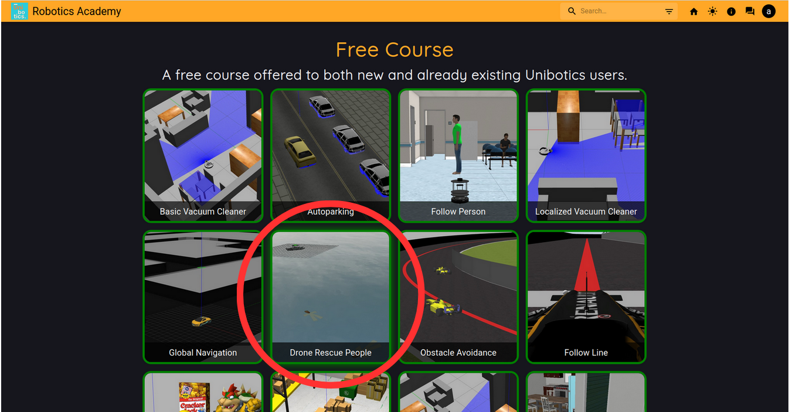
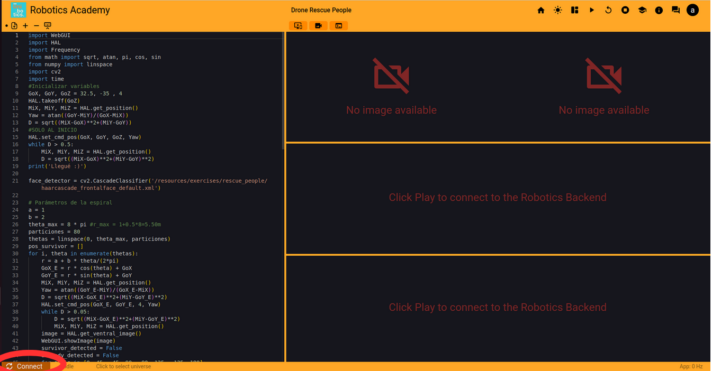
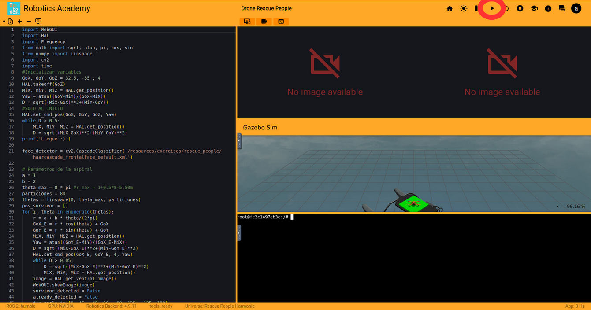

# Project: Robotics_UJI SJK001 (Carlos_Rodriguez)

This repository contains the code, usage instructions, explanation of how it works, and performance evaluation for the Unibotics exercise “Follow line”.

## Contents
- `code/` --> Source code of the three controller versions (P, PD, PID)
- `docs/discussion.md` --> Code discussion. **INTERESTING!**
- `docs/screenshots` --> Images used in `discussion.md`
- `images_installation` --> Images used in this `README.md`

## Usage instructions
Step 1:  
Download Docker from its official website: https://www.docker.com/

Step 2:  
From the terminal, run the following command to download the backend image:

```bash
docker pull jderobot/robotics-backend:latest
```

Depending on your hardware, run one of the following commands to start the container:

```bash
#Without graphic acceleration
docker run --rm -it \
  -p 6080-6090:6080-6090 -p 7163:7163 jderobot/robotics-backend:latest

#With graphic acceleration
docker run --rm -it --device /dev/dri \
  -p 6080-6090:6080-6090 -p 7163:7163 jderobot/robotics-backend:latest

#With NVIDIA card
docker run --rm -it --device /dev/dri --gpus all \
  -p 6080-6090:6080-6090 -p 7163:7163 jderobot/robotics-backend:latestt
```

Next, go to the Unibotics website https://unibotics.org/, create an account, and access the “Follow line” exercise.



Paste the code in the designated area and connect to the backend by clicking the button.



Finally, click the play button to run the code. All set!



© Carlos Luis Rodriguez Brito