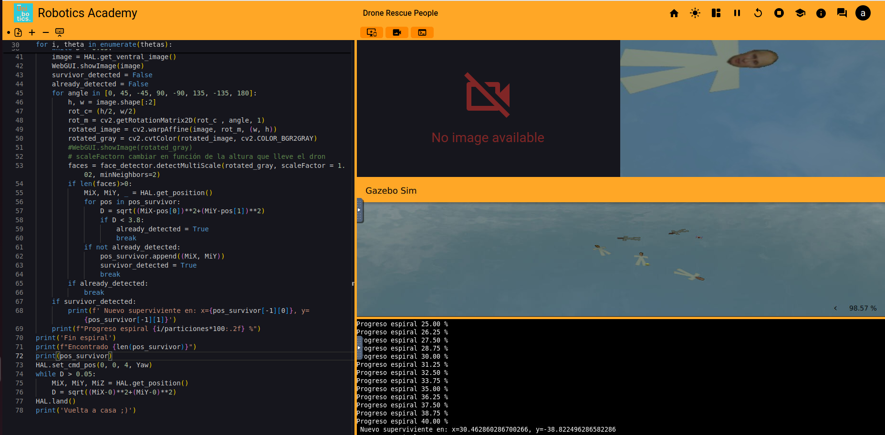
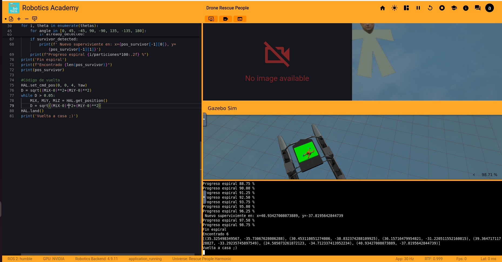

**Summary**

This document explains the drone search-and-rescue script. The script's objective is: take off, go to a target point, perform a spiral search around that point while capturing images and detecting faces (possible survivors), record detected positions, and return to base to land.

**Fundamental imports**

- `WebGUI`: display images in a web interface for monitoring.
- `HAL`: hardware/simulator API to control takeoff, position, movement, and to obtain images.
- `math` and `numpy`: geometric calculations for the spiral and distances.
- `cv2` (OpenCV): image processing and face detection.

**General script flow**

1. Initialize target coordinates `GoX, GoY, GoZ` and command takeoff with `HAL.takeoff(GoZ)`.
2. Compute orientation (`Yaw`) and distance (`D`) to the target and send `HAL.set_cmd_pos(GoX, GoY, GoZ, Yaw)`.
3. Wait until the drone is near the target (threshold 0.05 m).
4. Generate a spiral (parameters `a`, `b`, `theta_max`, `particiones`). Create a list of angles based on `particiones` and `theta_max` and iterate over it. Using mathematical formulas, compute the next position for the drone (always within the spiral), move the drone, capture the ventral image, rotate the image at several angles, and search for faces with a Haar classifier.
5. If a face is detected and it is not near a previous detection, save the drone's current position as a possible survivor.

6. At the end of the spiral, print a summary of the survivors (number of survivors and their locations).
7. Finally, return to `(0,0)` and land.

In this case my code locates the 6 people on the following locations:

|  Value (x,y)   |
|----------------|
|  (35.32, -35.73)  |
| (30.45, -38.83) |
|   (36.15, -31.22)  |
|   (39.36, -33.29)|
| (24.50 , -34.71) |
| (40.93, -37.81) |

**Important note!**
Due to the altitude at which the drone flies and the fact that we use the robot's coordinates when taking the photo where the person is detected, these coordinates are not the exact locations of the people but serve as a good approximation.