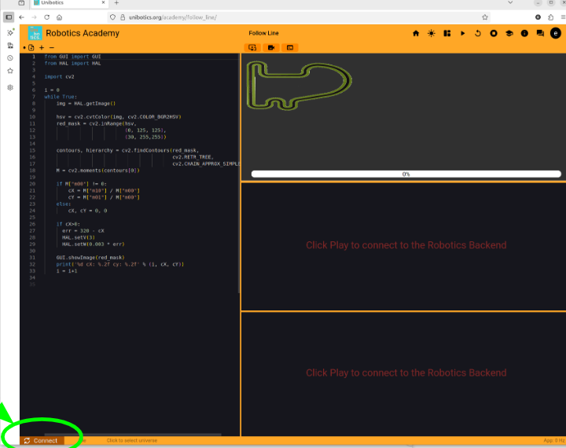

# Proyecto: Robotica_UJI (Carlos_Rodriguez_SJK001)

Este repositorio contiene el código, instrucciones de uso, explicación de funcionamiento y evaluación del rendimiento para el ejercicio 'Follow line' de Unibotics.

## Contenido
- `code/` — Código fuente 
- `docs/` — Documentación, explicaciones y capturas
- `requirements.txt` — Dependencias recomendadas

## Instrucciones de uso
Paso 1:
Descarga docker desde su página oficial: https://www.docker.com/

Paso 2:
Desde el terminal ejecuta el siguiente comando para descargar la imagen del backend:

```bash
docker pull jderobot/robotics-backend:latest
```

Dependiende dell hardware de tu equipo ejecutar uno de los siguientes comandos para lanzar el contenedor:

```bash
#Without graphic acceleration
docker run --rm -it \
  -p 6080-6090:6080-6090 -p 7163:7163 jderobot/robotics-backend:latest

#With graphic acceleration
docker run --rm -it --device /dev/dri \
  -p 6080-6090:6080-6090 -p 7163:7163 jderobot/robotics-backend:latest

#With NVIDIA card
docker run --rm -it --device /dev/dri --gpus all \
  -p 6080-6090:6080-6090 -p 7163:7163 jderobot/robotics-backend:latestt
```

A continuación ir a la web de unibotics https://unibotics.org/, crearse una cuenta y acceder al ejecicio 'Follow line'


Pegar el código el la zona designada para ello y conectar con el backend dándole al botón.


Finalmente darle al boton play para ejecutar el código. Todo listo!


# Carlos_Rodriguez_SJK001_Robotica_UJI