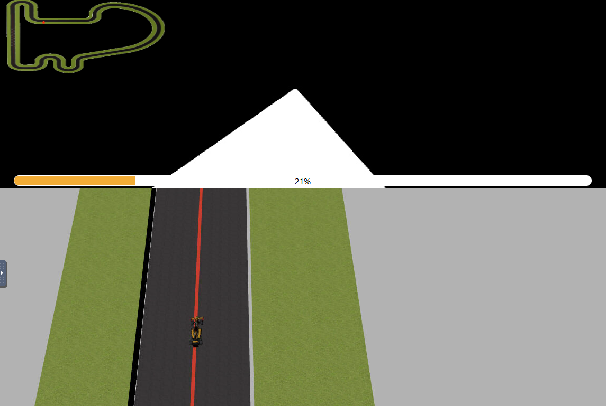

## Discusión parámetros
Como se puede observar en la carpeta '/code/' para los tres controladores 
se define la velocidad 'V' de la misma forma.

```python
if abs_err < 30:
    v = 8 
elif abs_err < 60:
    v = 3 
elif abs_err < 200:
    v = 2
elif abs_err < 250:
    v = 1
```

V es una velocidad variable que se define con una función escalón que reduce la velocidad
cuanto mayor es el error, la idea detrás de esto es que si el coche está alineado con
la linea de forma estable, como por ejemplo en una recta, podemos aumentar la velocidad sin perder
mucha estabilidad, pero si el error es mayor nos interesa ir más lento para que el coche tenga
tiempo de alinearse con la recta.



Esto sin embargo tiene la contra de que en una curva pude alinearse momentanemente con la recta
y pegar un acelerón que desestabilice la trayectoria. La función definida V se ha definido teniendo en
cuenta la forma de la pista y los otros parámetros definidos a través de prueba y error.


Los parámetros definidos para la velocidad angular son:

| Constante |  Valor   |
|-----------|----------|
| kp        |   0.008  |
| ki        | 0.000005 |
| kd        |   0.003  |

La velocidad angular W se define de la siguiente manera:

```python
HAL.setW(P+I+D)
```
En al apartado siguiente se explicarán las tres variables P,I,D. Y los tipos
de controladores implementados.

## Explicación tipos controladores
**P: acción de control proporcional**

Da una respuesta proporcional al error. En el código se ha implementado de la siguiente manera.

```python
P = kp*err
```

**I: acción de control integral**

Da una respuesta proporcional al error acomulado hasta que el error es cercano a 0 (Se resetea el error acomulado).
En el código que ha considerado que si abs_err < 45 entonces err es cercano a 0.

```python
if abs_err < 45:
    I = 0
       else:
    I = I + ki*err
```
**D: acción de control derivativo**

Da una respuesta proporcional al ratio de cambio del error respecto al tiempo.

```python
D = kd*(err-err_ant)
```

**Controlador_P:** Solo actúa P.

**Controlador_PI:** Solo actúa P y I.

**Controlador_PID:** Actúan todas las variables (P, I, D).

## Explicación obtención error
El error utilizado para alinear el robot con la linea se basa en el centroide. El centroide es punto que representa la “posición media” del contorno/objeto detectado. En este caso se obtiene el el centroide de la linea. Se crea una máscara por color (HSV) para aislar la linea roja. Trabajar sobre una máscara binaria y extraer contornos es más eficiente que procesar toda la imagen.

```python
img = HAL.getImage()
hsv = cv2.cvtColor(img, cv2.COLOR_BGR2HSV)
red_mask = cv2.inRange(hsv, (0,125,125), (30,255,255))
contours, hierarchy = cv2.findContours(red_mask, cv2.RETR_TREE, cv2.CHAIN_APPROX_SIMPLE)
M = cv2.moments(contours[0])
if M["m00"] != 0:
    cX = M["m10"] / M["m00"]
    cY = M["m10"] / M["m00"]
else:
    cX, cY = 0, 0
```

Para calcular el error se toma la coordenada x del centroide y se resta del centro de la imagen (x=320 en ancho 640) para obtener la desviación lateral que alimenta el controlador.

```python
err = 320 - cX
```
## Discusión métodos
A continuación discutiremos las ventajas y desventajas de los tres tipos de controladores
implementados estudiando los tiempos obtenidos.

| Controlador | Tiempo (s) |
|-------------|------------|
| P           | 123,05     |
| PD          | 119,17     |
| PID         | 124,23     |

**PD aporta mayor estabilidad en esta pista:** 
La acción derivativa atenúa oscilaciones y mejora la respuesta ante cambios (principalmente las curvas), lo que reduce el tiempo total respecto a solo P.

**PID muestra más inestabilidad aquí debido a la acción integral:** 
La acumulación de error puede inducir correcciones excesivas en las curvas (Por el factor integral), provocando sobreimpulsos y peores tiempos repecto a P y PD.